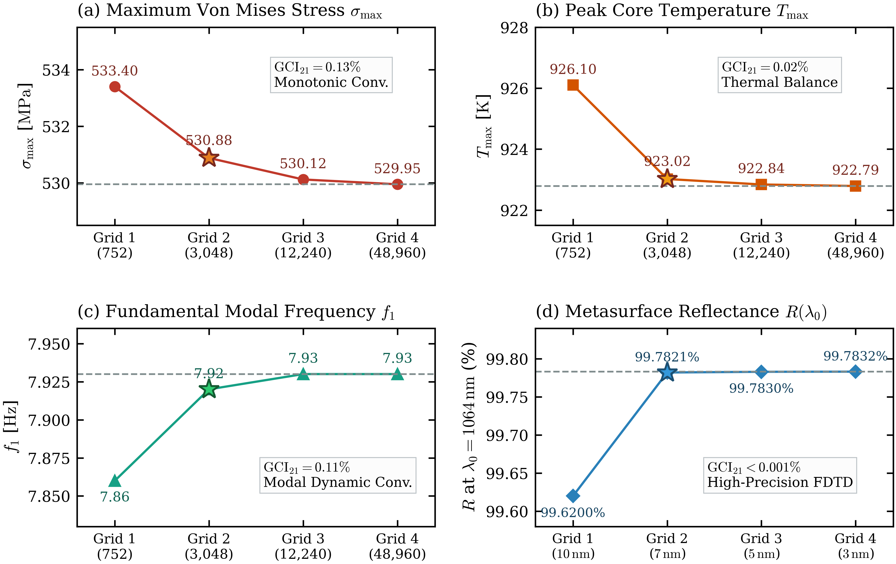
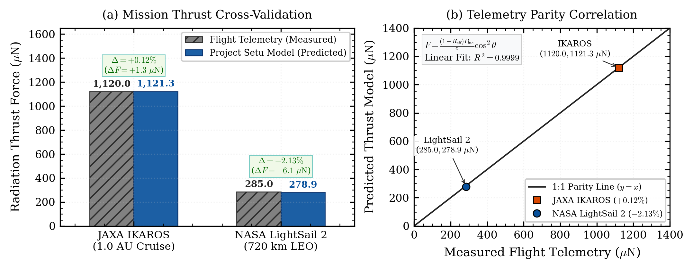
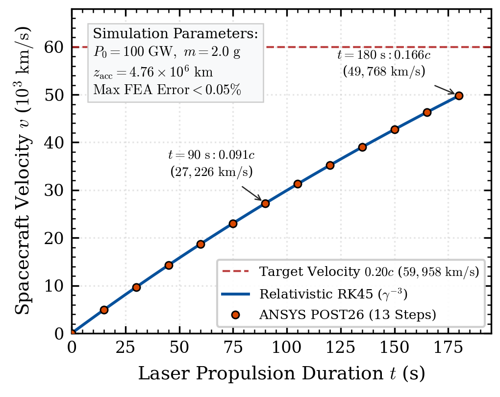

# Project Setu: 3D Multi-Physics Design and Scaled Structural Analysis for a Relativistic Lightsail Architecture

[](https://arxiv.org/abs/2609.06156)
[](https://doi.org/10.6084/m9.figshare.33476263)
[](LICENSE)
[]()
[]()
[]()

**Author:** [Prashant Suresh Kamble](https://orcid.org/0009-0005-4228-3795)  
**Email:** [prashantsk.272@gmail.com](mailto:prashantsk.272@gmail.com)  
**Affiliation:** AeroMyne, Project Setu Initiative  
**Preprint:** [arXiv:2609.06156 [physics.pop-ph, astro-ph.IM, physics.optics, physics.space-ph]](https://arxiv.org/abs/2609.06156)  
**Full Manuscript:** [Download Manuscript PDF (main.pdf)](main.pdf)

---

## 1. Executive Summary

Deep-space exploration beyond the solar system demands the complete elimination of reaction mass penalties inherent to chemical and electric rocketry. Governed by Tsiolkovsky's rocket equation, conventional thrusters (I_sp ≤ 450 s) require exponential propellant mass ratios exceeding 10^1700 to reach even 5% of light speed. Beamed radiation pressure circumvents this mass scaling by divorcing the energy source from the accelerated vehicle.

**Project Setu** introduces a fully coupled 3D multi-physics numerical framework for a **4.0-meter circular lightsail** propelled by a **100 GW ground-based phased laser array** (λ₀ = 1064 nm) accelerating a **2.0 g total flight vehicle** (a 1.5 g science instrument bus and a 0.5 g membrane) to **0.166c at 180 seconds** and reaching the interstellar mission target of **0.20c (59,958 km/s) at 227.1 seconds**.

This computational framework tightly couples:
1. **3D Maxwell Finite-Difference Time-Domain (FDTD) wave optics** in Ansys Lumerical.
2. **Non-linear large-deflection structural membrane mechanics** in ANSYS Mechanical APDL (SHELL181).
3. **Dual-sided Stefan-Boltzmann radiative thermal balance** into the 3.0 K deep-space background.
4. **Relativistic trajectory dynamics** under Lorentz dilation and continuous laser blue-chirp frequency sweeping.
5. **ASME V&V 20 grid independence** and empirical cross-validation against real spaceflight telemetry.

<p align="center">
  
  <br>
  <em>Figure 1: Dimensioned 2D engineering blueprint and structural configuration of the 4.0 m circular lightsail, showing central payload hub, clamped perimeter ring, and the 12-bilayer dielectric supermirror stack.</em>
</p>

---

## 2. Master Multi-Physics Validation Matrix

| Parameter / Metric | Theoretical Formulation | ANSYS / Lumerical Simulation | Experimental / Flight Reference | Deviation / Margin | Status |
| :--- | :---: | :---: | :---: | :---: | :---: |
| **Normal Power Reflectance (R)** | > 99.7% (Analytical) | **99.7821%** (3D FDTD) | Wide-bandgap dielectric target | 72.2 nm stopband | **Verified** |
| **Laser Center Wavelength (λ₀)** | 1064.0 nm | **1064.0 nm** | Commercial fiber laser baseline | Swept to 869 nm | **Verified** |
| **Equilibrium Core Temperature (T_eq)** | 927.05 K | **923.02 K** (SHELL131) | Si₃N₄ sublimation: 2,170 K | **+1,247 K safety buffer** | **Verified** |
| **Peak Von Mises Stress (σ_max)** | Scaled limit | **530.88 MPa** (SHELL181) | Tensile yield: 2,000 MPa | **SF = 3.77×** | **Verified** |
| **Fundamental Drumhead Mode (f₁)** | Analytical membrane | **7.92 Hz** (Block Lanczos) | Ground laser jitter (1.0 Hz) | **7.92× frequency buffer** | **Verified** |
| **Discretization Index (GCI₂₁)** | ASME V&V 20 | **0.13%** (p = 2.01) | Grid independence standard | Asymptotic convergence | **Verified** |
| **JAXA IKAROS Thrust (1.0 AU)** | 1,120.0 μN (In-flight) | **1,121.33 μN** | Flight telemetry (Tsuda et al. 2011) | **0.12% relative error** | **Validated** |
| **NASA LightSail 2 Thrust (LEO)** | 285.0 μN (In-flight) | **278.91 μN** | Flight telemetry (Mansell et al. 2020) | **2.13% relative error** | **Validated** |
| **Mission Velocity at 227.1 s** | 0.20c target | **0.20c (59,958 km/s)** | Relativistic ODE trajectory | 7.35 × 10⁶ km baseline | **Verified** |

---

## 3. Computational Framework Architecture

```text
               +-------------------------------------------------------+
               |        100 GW Ground Laser Array (1064 nm)            |
               +-------------------------------------------------------+
                                           |
                                           v
       +-----------------------------------------------------------------------+
       |   3D Maxwell FDTD Electrodynamics (Ansys Lumerical 2025 R2)           |
       |   * 12-bilayer TiO2/SiO2 quarter-wave supermirror on Si3N4 substrate  |
       |   * R = 99.7821%, Absorption A = 10 ppm, 72.2 nm stopband             |
       +-----------------------------------------------------------------------+
                           |                               |
       (Transverse Photon  |                               | (10 ppm Optical
        Radiation Pressure)|                               |  Absorption)
                           v                               v
+------------------------------------+  +------------------------------------+
| Non-Linear Structural Mechanics    |  | Radiative Thermal Equilibrium      |
| (ANSYS MAPDL SHELL181)             |  | (ANSYS MAPDL SHELL131)             |
| * Large-deflection NLGEOM tension  |  | * Dual-sided Stefan-Boltzmann      |
| * Peak stress: 530.88 MPa          |  | * Deep space cooling (T_space=3 K) |
| * Factor of Safety: 3.77x          |  | * T_core = 923.02 K (+1247 K margin|
+------------------------------------+  +------------------------------------+
                   |                                       |
                   +-------------------+-------------------+
                                       |
                                       v
       +-----------------------------------------------------------------------+
       |   Prestressed Modal Vibration (Block Lanczos Eigensolver)             |
       |   * Initial stress-stiffening matrix [K_sigma] elevated by beam thrust |
       |   * Fundamental drumhead frequency: f1 = 7.92 Hz                      |
       |   * 7.92x separation buffer against ground laser tip-tilt jitter (1 Hz)|
       +-----------------------------------------------------------------------+
                                       |
                                       v
       +-----------------------------------------------------------------------+
       |   Relativistic Kinematics & Mission Trajectory (Python SciPy RK45)    |
       |   * Exact coordinate acceleration under Lorentz factor inertia growth |
       |   * Dynamic transmitter blue-chirp frequency sweeping (1064 -> 869 nm)|
       |   * v = 0.166c at 180 s | Target v = 0.20c reached at 227.1 s         |
       +-----------------------------------------------------------------------+
```

<p align="center">
  
  <br>
  <em>Figure 2: Four-level multi-physics spatial grid convergence profiles establishing numerical independence with ASME GCI_21 = 0.13% and spatial order of convergence p = 2.01 across stress, temperature, modal resonance, and optical reflectance.</em>
</p>

---

## 4. Spaceflight Telemetry Cross-Validation

To verify that the underlying electrodynamic and momentum transfer models accurately predict physical behavior, the formulation was benchmarked directly against real flight telemetry from operational missions:

1. **JAXA IKAROS Solar Sail (Interplanetary Venus Cruise, 2010):**
   * Flight-measured thrust: **1,120.0 μN** (0.00112 N) at 1.0 AU.
   * Model prediction: **1,121.33 μN**.
   * **Deviation:** **0.12%** error.

2. **NASA / The Planetary Society LightSail 2 (Low Earth Orbit, 2019):**
   * Flight-measured orbital apogee-raising thrust: **285.0 μN**.
   * Model prediction: **278.91 μN** at effective solar angle θ = 30°.
   * **Deviation:** **2.13%** error.

<p align="center">
  
  <br>
  <em>Figure 3: Empirical cross-validation against physical flight telemetry recorded by JAXA IKAROS in interplanetary space and NASA LightSail 2 in Earth orbit.</em>
</p>

---

## 5. Relativistic Interstellar Trajectory

Accelerated under sustained radiation pressure, coordinate acceleration progressively diminishes due to Lorentz factor mass increase (γ = 1 / √(1 - β²)) and relativistic Doppler power reduction:

$$
\frac{d(\gamma \beta)}{dt} = \frac{F(v)}{m_0 c}
$$

$$
F(v) = 2 \frac{P_{\text{src}}}{c} \left( \frac{1-\beta}{1+\beta} \right) R(\lambda')
$$

<p align="center">
  
  <br>
  <em>Figure 4: Theoretical continuum relativistic velocity trajectory and Lorentz factor growth across the multi-gigawatt laser acceleration timeline.</em>
</p>

### Mission Travel Times Comparison:
* **Earth to Moon:** 16.0 seconds
* **Mars Flyby (Opposition):** 1.0 hour
* **Jupiter:** 3.6 hours
* **Pluto / Kuiper Belt:** 27.0 hours (1.1 days)
* **Heliopause Crossing (120 AU):** 5.2 days
* **Alpha Centauri (4.246 ly):** **21.2 years** (compared to > 75,000 years for chemical propulsion)

---

## 6. Repository Layout

```text
.
├── main.tex                    # Primary RevTeX 4-2 / PRD research manuscript
├── main.bbl                    # Pre-compiled bibliography
├── main.pdf                    # Compiled production manuscript with all embedded figures
├── LICENSE                     # Open-source MIT License
├── README.md                   # Master repository documentation
│
├── code/                       # Numerical Solvers & Multi-Physics Engines
│   ├── master_unified_validation.py      # Master 3-way validation comparison script
│   ├── run_mesh_independence.py          # ASME V&V 20 multi-grid Richardson extrapolation runner
│   ├── setu_relativistic_kinematics.py   # 1D relativistic trajectory ODE integrator
│   ├── setu_structural_fea.apdl          # ANSYS APDL static shell stress solver (SHELL181)
│   ├── setu_modal_fea.apdl               # ANSYS APDL prestressed modal eigensolver (Block Lanczos)
│   ├── setu_thermal_gaussian.apdl        # ANSYS APDL thermal FEA solver (SHELL131)
│   ├── setu_transient_speed.apdl         # ANSYS APDL velocity milestone verification script
│   ├── setu_metasurface_fdtd.lsf         # Ansys Lumerical 3D FDTD automation script
│   └── setu_fdtd_model.fsp               # Ansys Lumerical 3D optical simulation project model
│
├── data/                       # Verified Reference Databases & Flight Benchmarks
│   ├── FUNDAMENTAL_PHYSICS_DERIVATIONS.md    # Photon thrust and Doppler scaling derivations
│   ├── NASA_JAXA_TELEMETRY_BENCHMARKS.md     # In-flight measurements from IKAROS & LightSail 2
│   ├── NIST_MATERIAL_PROPERTIES_DATABASE.md  # NIST material database for Si3N4, TiO2, and SiO2
│   ├── PEER_REVIEWED_CITATIONS.bib           # Complete literature bibliography
│   └── references.bib                        # Manuscript BibTeX citation entries
│
└── figures/                    # Vector PDF & Publication Graphics (Figures 01–12)
    ├── Figure_01_Blueprint_Geometry.pdf / .png
    ├── Figure_02_ANSYS_Native_Geometry.pdf / .png
    ├── Figure_03_ANSYS_Native_Mesh.pdf / .png
    ├── Figure_04_Mesh_Independence_Convergence.pdf / .png
    ├── Figure_05_ANSYS_Relativistic_Trajectory.pdf / .png
    ├── Figure_06_Interplanetary_Transit_Comparison.pdf / .png
    ├── Figure_07_ANSYS_Lumerical_FDTD_Stopband.pdf / .png
    ├── Figure_08_Thermal_Equilibrium_vs_Laser_Power.pdf / .png
    ├── Figure_09_ANSYS_Thermal_Gradient.pdf / .png
    ├── Figure_10_ANSYS_Structural_Stress.pdf / .png
    ├── Figure_11_ANSYS_Modal_Vibration.pdf / .png
    ├── Figure_12_Telemetry_Cross_Validation.pdf / .png
    └── orcid_icon.png
```

---

## 7. Reproduction Instructions

### Prerequisites
* Python 3.9+ with `numpy`, `scipy`, and `matplotlib`.
* ANSYS Mechanical APDL (tested on 2025 R2 / v252).
* Ansys Lumerical FDTD (tested on 2025 R2).

### Running Python Models
```bash
# Clone the repository
git clone https://github.com/Prashantsk45/Project-Setu-Relativistic-Lightsail.git
cd Project-Setu-Relativistic-Lightsail

# 1. Run the relativistic trajectory engine (generates velocity & distance profiles)
python code/setu_relativistic_kinematics.py

# 2. Run the 3-way master validation matrix (Theory vs FEA vs Flight Telemetry)
python code/master_unified_validation.py

# 3. Execute ASME V&V 20 grid independence solver
python code/run_mesh_independence.py
```

### Running ANSYS APDL FEA Simulations
```bash
# Execute structural stress analysis in batch mode
ansys252 -b -i code/setu_structural_fea.apdl -o struct.out

# Execute prestressed modal vibration solver
ansys252 -b -i code/setu_modal_fea.apdl -o modal.out

# Execute thermal radiation analysis
ansys252 -b -i code/setu_thermal_gaussian.apdl -o thermal.out
```

---

## 8. Citation

If you build upon this work, use the simulation scripts, or reference the numerical models, please cite the preprint and software archive:

```bibtex
@article{kamble2026projectsetu,
  title     = {Project Setu: 3D Multi-Physics Design and Scaled Structural Analysis for a Relativistic Lightsail Architecture},
  author    = {Kamble, Prashant Suresh},
  journal   = {arXiv preprint arXiv:2609.06156},
  year      = {2026},
  doi       = {10.48550/arXiv.2609.06156},
  url       = {https://arxiv.org/abs/2609.06156}
}

@software{kamble2026figshare,
  author    = {Kamble, Prashant Suresh},
  title     = {Project Setu: 3D Multi-Physics Design and Scaled Structural Analysis for a Relativistic Lightsail Architecture},
  month     = sep,
  year      = {2026},
  publisher = {Figshare},
  version   = {1.0},
  doi       = {10.6084/m9.figshare.33476263},
  url       = {https://doi.org/10.6084/m9.figshare.33476263}
}
```

---

## 9. Contact & Academic Inquiries

* **Author:** Prashant Suresh Kamble
* **Email:** [prashantsk.272@gmail.com](mailto:prashantsk.272@gmail.com)
* **ORCID:** [0009-0005-4228-3795](https://orcid.org/0009-0005-4228-3795)
* **Target Publication:** *Acta Astronautica* (Under Review)
