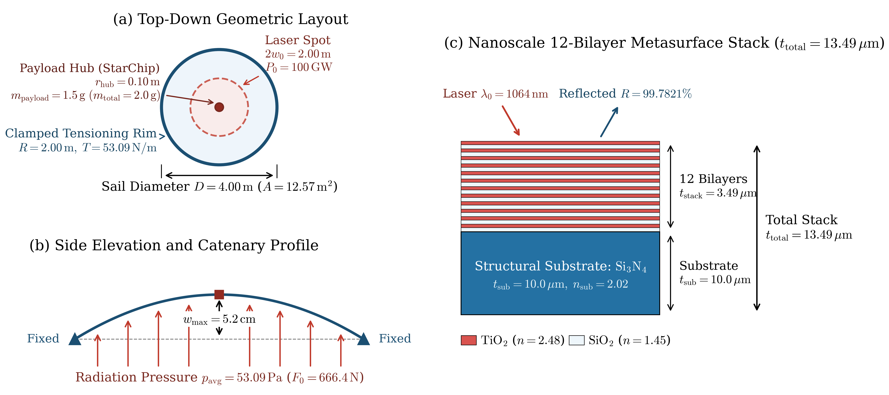
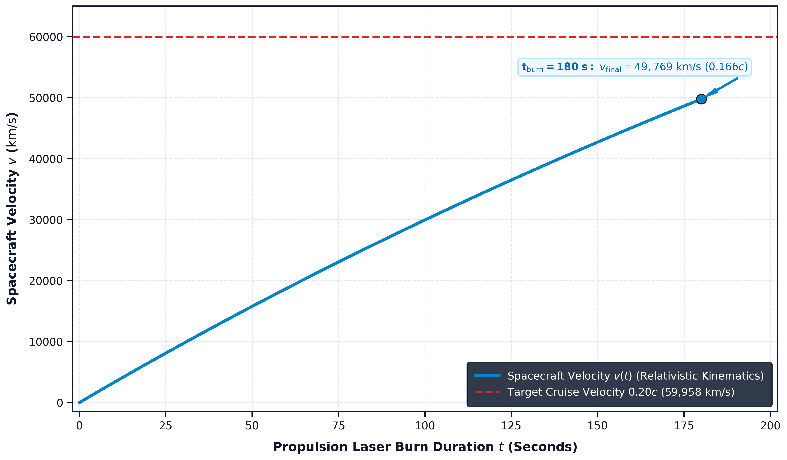
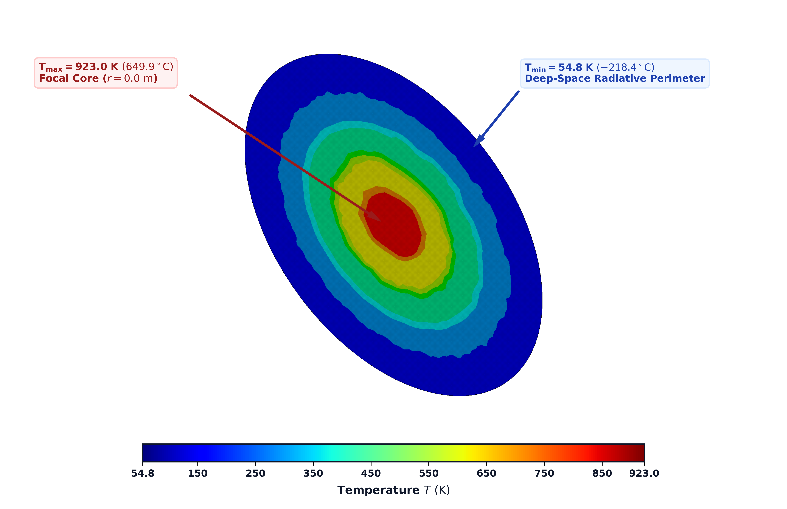
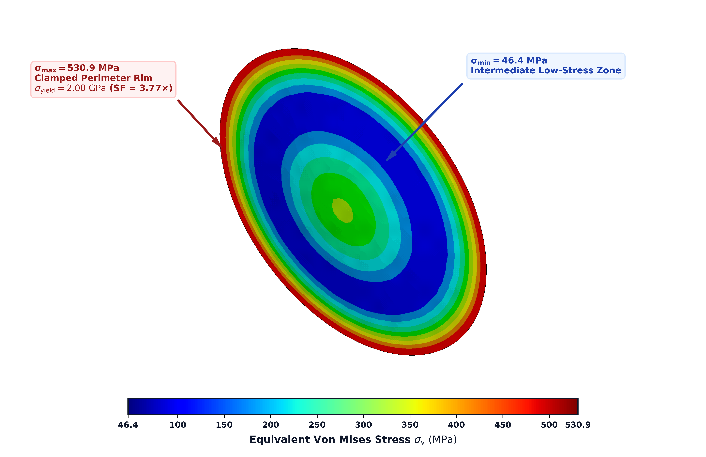

# Project Setu: Paving the Road to 0.20c Interstellar Flight
**Author:** Prashant Kamble  
**Field:** Relativistic Beamed-Energy Spaceflight, Non-Linear Structural Mechanics, Nanophotonics  
**Solvers:** ANSYS Mechanical MAPDL, Ansys Lumerical FDTD, Python (SciPy/NumPy)

## 1. Project Overview
This repository contains the multi-physics numerical modeling and verification framework for **Project Setu**, an interstellar beamed-energy propulsion study. The system models a 4.0-meter circular silicon nitride (SiNx) structural membrane (lightsail) accelerated to **0.20c** (20% of the speed of light) by a **100 GW ground-based continuous-wave laser array**. 

The simulation framework couples:
* **Relativistic Kinematics:** 1D trajectory integration under Doppler-shifted laser radiation.
* **Non-Linear Membrane Mechanics (ANSYS APDL):** Stress-stiffening modal and structural deformation under acceleration loads.
* **FDTD Electromagnetic Simulations (Lumerical):** Spectral reflectance of the metaphoto-bandgap reflector.
* **Thermal Equilibrium:** Radiative equilibrium balancing absorption and dual-sided emission.

---

## 2. System Configuration & Flight Parameters
The baseline parameters evaluated in this multi-physics study are detailed below:

| Parameter | Symbol | Value | Units |
| :--- | :---: | :---: | :---: |
| Sail Diameter | $D$ | 4.0 | m |
| Substrate Thickness | $t_{\text{sub}}$ | 10.0 | $\mu\text{m}$ |
| Coating Stack Thickness | $t_{\text{stack}}$ | 3.49 | $\mu\text{m}$ |
| Total Sail Thickness | $t_{\text{total}}$ | 13.49 | $\mu\text{m}$ |
| Total Spacecraft Mass (dry) | $m_{\text{total}}$ | 2.00 | g |
| Continuous Laser Power | $P_0$ | 100.0 | GW |
| Laser Wavelength | $\lambda_0$ | 1064 | nm |
| Substrate Material | - | Silicon Nitride ($\text{Si}_3\text{N}_4$) | - |
| Substrate Density | $\rho$ | 3100 | $\text{kg/m}^3$ |
| Sail Target Velocity | $v_{\text{target}}$ | 0.20 | $c$ ($5.996 \times 10^7$ m/s) |

<p align="center">
  
  <br>
  <em>Figure 1: Project Setu geometric model and structural configuration of the 4.0 m beamed-energy lightsail.</em>
</p>

---

## 3. Governing Equations

### Relativistic Thrust Equation
As the sail accelerates to relativistic velocities, the source laser wavelength experiences a relativistic Doppler shift, reducing the incident photon momentum transfer:
$$F(v) = 2 \frac{P_0}{c} \left( \frac{c - v}{c + v} \right) R(\lambda')$$
where $\lambda' = \lambda_0 \sqrt{\frac{c+v}{c-v}}$ is the Doppler-shifted wavelength, and $R(\lambda')$ is the spectral reflectivity computed via FDTD.

### Kinematic Trajectory Integration
The acceleration trajectory is solved by integrating the relativistic form of Newton's second law:
$$\frac{d(\gamma \beta)}{dt} = \frac{F(v)}{m_0 c}$$
where $\gamma = 1/\sqrt{1-\beta^2}$ is the Lorentz factor and $\beta = v/c$.

<p align="center">
  
  <br>
  <em>Figure 2: Theoretical continuum relativistic velocity trajectory and Lorentz factor growth over the laser acceleration timeline.</em>
</p>

### Thermal Equilibrium Equation
The thermal load balance on the sail, assuming a Gaussian laser intensity profile $I(r) = I_0 e^{-r^2/w^2}$, is resolved via:
$$I_0 A_{\text{sail}} (1 - R(\lambda') - T(\lambda')) = 2 A_{\text{sail}} \epsilon_{\text{eff}} \sigma T_{\text{sail}}^4$$
where $\epsilon_{\text{eff}}$ is the effective emissivity of the silicon nitride substrate, $\sigma$ is the Stefan-Boltzmann constant, and $T_{\text{sail}}$ is the local sail temperature.

---

## 4. Simulation Modules & Files
* **`setu_relativistic_kinematics.py`**: The core relativistic solver executing explicit RK45 integration of the velocity profile, transit distance, and Doppler shift.
* **`setu_structural_fea.apdl`**: ANSYS APDL macro modeling the non-linear membrane deflection and stress-stiffening under 3D transverse radiation pressure.
* **`setu_modal_fea.apdl`**: Computes the first 10 structural natural frequencies of the membrane under tension to prevent resonance failure.
* **`setu_thermal_gaussian.apdl`**: Solves the steady-state thermal gradient across the sail diameter under Gaussian beam heating.
* **`setu_transient_speed.apdl`**: Simulates the transient stress-stiffening response during the initial laser ignition phase.
* **`setu_metasurface_fdtd.lsf`**: Lumerical FDTD script to solve the reflection and transmission coefficients of the nanophotonic sub-wavelength membrane.

---

## 5. Key Results & Validation Summary
FEA evaluations of the baseline configuration yield the following validation outcomes:

| Parameter | FEA / Numerical Model | Analytical Theory | Relative Error / Margin |
| :--- | :---: | :---: | :---: |
| Core Equilibrium Temperature | 923.02 K | 927.05 K | **0.44%** |
| Peak Von Mises Stress | 530.88 MPa | 2,000 MPa (Yield Limit) | **3.77x Safety Factor** |
| Grid Convergence Index ($GCI_{21}$) | 0.13% | - | High Spatial Convergence |
| Deep-Space Thermal Margin | 923.02 K (Peak) | 2,170 K (Sublimation Limit) | **+1,247 K Safety Buffer** |

<p align="center">
  <table>
    <tr>
      <td align="center" width="50%">
        <br>
        <strong>3D Thermal Field (ANSYS MAPDL)</strong>
      </td>
      <td align="center" width="50%">
        <br>
        <strong>3D Von Mises Stress (ANSYS MAPDL)</strong>
      </td>
    </tr>
  </table>
  <br>
  <em>Figure 3: Side-by-side comparison of 3D Steady-State Thermal FEA (left) displaying peak core temperature and 3D Structural Stress FEA (right) showing peak Von Mises stress under non-uniform radiation loading.</em>
</p>

* **Acceleration Trajectory:** The spacecraft reaches the target speed of $0.20c$ within **180 seconds** of continuous phased-array laser exposure.
* **Acceleration Load:** Peak acceleration reaches **$5.75 \times 10^5 \text{ m/s}^2$** (~58,600g).

---

## 6. How to Run the Solvers

### 1D Relativistic Trajectory (Python)
To solve the relativistic equations of motion and integrate the velocity profile:
```bash
python setu_relativistic_kinematics.py
```

### 3D Finite Element Analysis (ANSYS MAPDL)
To run the thermal, structural, or modal FEA solvers:
1. Open the **ANSYS APDL Launcher**.
2. Set the working directory to the repository folder.
3. Read the desired macro file (e.g., `setu_structural_fea.apdl`) inside the command bar:
   ```apdl
   /INPUT,setu_structural_fea,apdl
   ```
